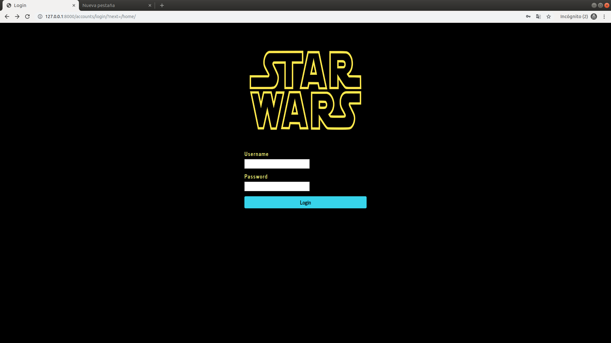
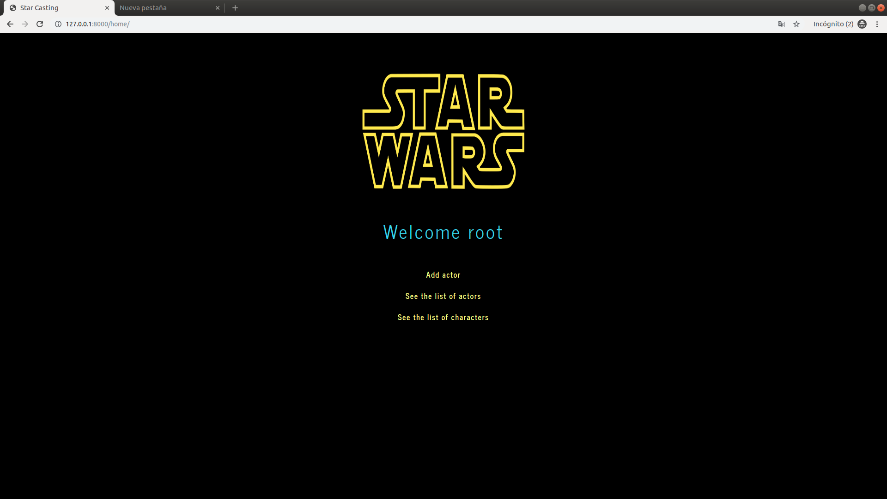
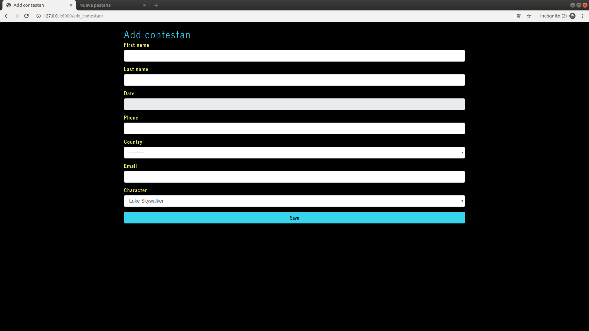
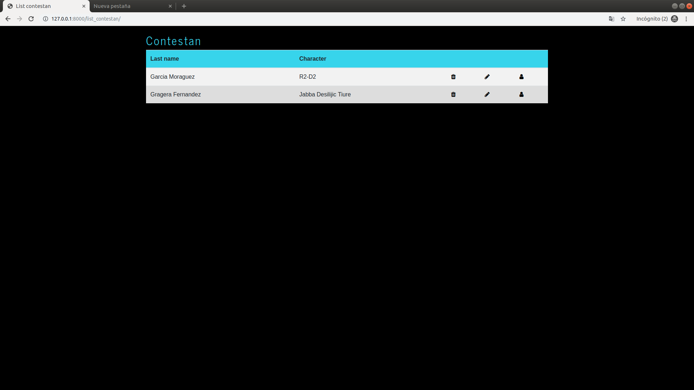
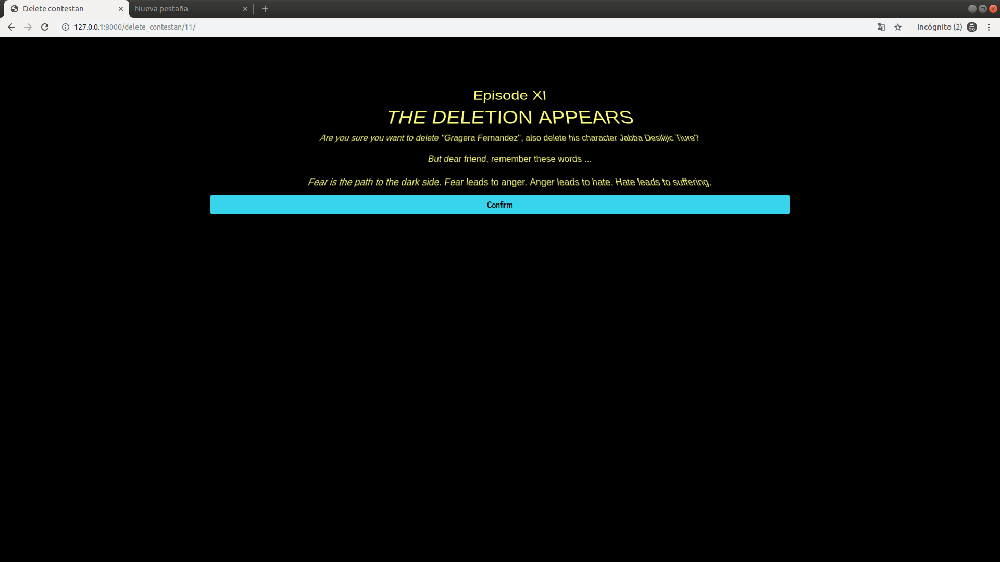
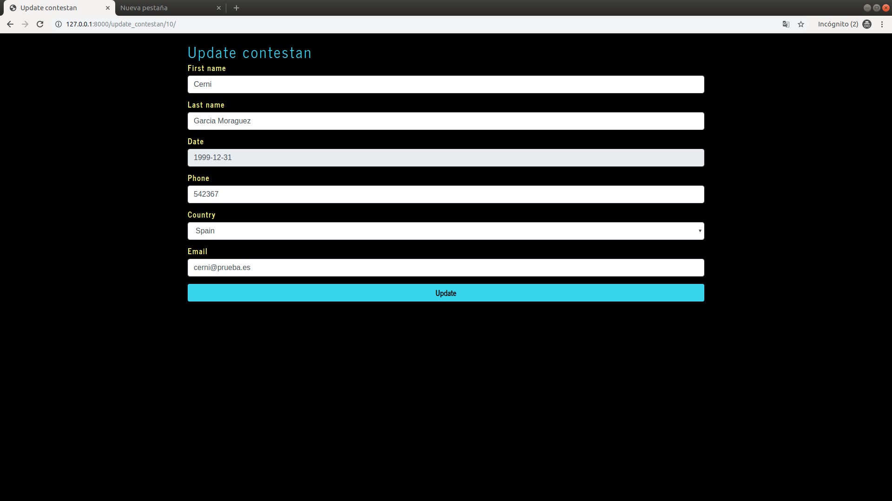
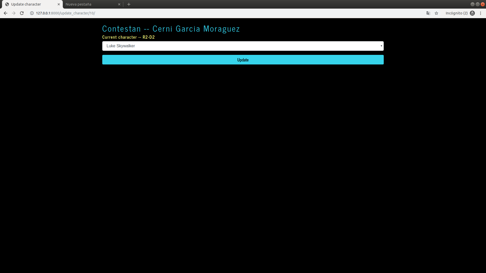
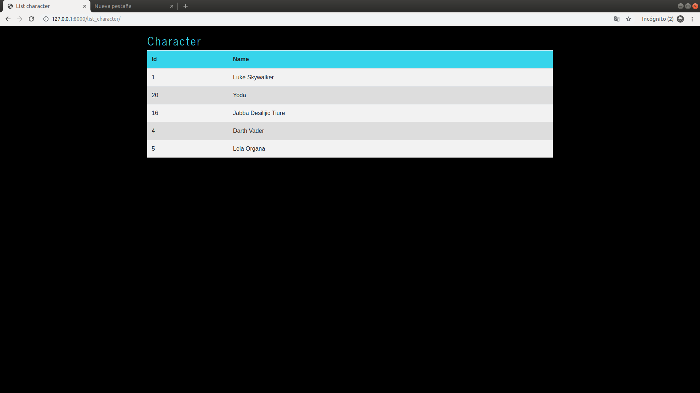

## STAR WARS CHARACTER CASTING  #

### Tecnologías usadas

* Django
* mysql
* Requests
* Ajax
* Bootstrap
* Css
* Python
* jQuery
* Json

Pasos para cargar el proyecto en tu pc 

* Linux

```console
$ git clone https://github.com/Pgragerai/stars.git
```

Una vez clonado el proyecto será necesario instalar Django en nuestra máquina, para ello se puede seguir el siguiente tutorial 

https://tutorial.djangogirls.org/es/django_installation/

A continuación, de realizar la instalación de los elementos que se comenta en el tutorial levantaremos el servidor del proyecto.

* Linux

```console
$ python manage.py runserver
```

## Proyecto

Una vez realizado los paso anteriores, debemos acceder a la siguiente dirección.

http://127.0.0.1:8000/home

Si usted no está logeado aparecerá la siguiente pantalla.



Usted se podrá logear usando el siguiente usuario. 

* Username: root
* Password: root

Si se ha logeado correctamente le aparecerá la siguiente pantalla.



Como se puede apreciar el "Home" contiene tres apartados "Add contestan" (añadir actor), "See the list of actors" (Ver la lista de actores) y "See the list of characters" (Ver la lista delo personajes que hay en el sistema)

A continuación observaremos la pantalla de "Add contestan".



Podemos observar que es un formulario para introducir los datos del actor.

A continuación observaremos la pantalla de "See the list of actors".



En dicha pantalla observaremos una lista de los actores registrados en el sistema. Sobre el actor podemos realizar tres acciones. Borrar dicho actor, editar los datos del actor y actualizar el personaje del actor.

* Borrar actor



* Actualizar los datos



* Actualizar el personaje



A continuación observaremos la pantalla de "See the list of characters".



Comentar que el proyecto cuenta con un diseño Responsive, la lista de los actores se ordena alfabéticamente por su apellido, y como hemos visto al comienzo de este documento un login para usuarios

Si usted quiere acceder al admin del proyecto podra accerlo en la siguiente direccion.

http://127.0.0.1:8000/admin/

Las credenciales son las anteriores mencionadas root - root


